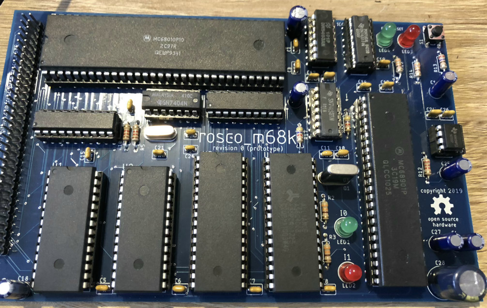

# Motorola 68k single-board computer

> **Note** As a temporary fix for issue #7 all firmware is currently
  built with the `-DREVISION_0` symbol defined. This changes the 
  MFP register addressing to work around an issue with the r0 board.
  While this will stop being the default once fixed boards are available,
  you should ensure you undefine it (in the Makefiles) if you're building
  for a board that does not have this issue before the 'official' fix
  is available!

This repository holds design files, firmware and software for my m68k 
single-board computer, AKA the Rosco_m68k.

You can find the project along with some logs about its development
on Hackaday: https://hackaday.io/project/164305-yet-another-m68k-homebrew

* All Software released under the MIT licence. See LICENSE for details.
* All Hardware released under the CERN Open Hardware licence.See LICENCE.hardware.txt.
* All Documentation released under Creative Commons Attribution. See https://creativecommons.org/licenses/by/2.0/uk/

## Current design

Currently, the design for the system is:

* MC68010P10 at 8MHz, /DTACK no longer grounded but still zero-wait-state for RAM/ROM accesses.
* MC68901 MFP provides UART, Timers and Interrupt vectoring
* 256KB IO Space (0xF80000 - 0xFBFFFF)
* 16KB ROM (at 0xFC0000, 256KB reserved for ROM up to 0xFFFFFF)
* 1MB RAM (0x0 - 0xFFFFF)
* ~TTL-based address decoding~ Decode and glue logic are now handled by ATF16V8BQL PLDs. Only four 7400-series chips remain.
* ~The current prototype is breadboard based, but I have a basic PCB design and am hoping to get prototypes made soon!~
  * Prototypes are now made and verified working (with [a few minor issues](https://github.com/roscopeco/rosco_m68k/projects/1)). Gerbers for this r0 board can be found in https://github.com/roscopeco/rosco_m68k/tree/master/design/CAM/r0/CAMOutputs. The populated prototype looks like this:

In terms of software:

* A serial bootloader that can load software via the UART (with Kermit protocol)
* A proof-of-concept "kernel" that demonstrates the serial loader
* Built with GCC 7.5 and VASM

## Next steps

* Graphics - I'm thinking maybe Yamaha V9958 (assuming I can get hold of one)
  * I would have liked to have used a Denise, but that would probably also require a (non-breadboard-friendly) Agnus.
  * The datasheet and manual for the Denise probably aren't as easy to come by, nor as complete, so there'd be more reverse-engineering.
  * And anyway, the Yamaha looks like a nice chip to play with...
* OS - Now that timers are available and I have some I/O capability, I want to build out the OS.
  * Microkernel architecture (Similar in principle to Exec)
  * Preemptive multitasking
  * External storage (probably CF or SD in the first instance, though SD would require level shifting).

## Ideas for future enhancement

### Minimal memory protection

Extend address decoder to disallow access to certain locations based on 68k function pins.
E.g. in user mode:

* Disallow ROM
* Disallow IO
* Disallow xKB at bottom of RAM (ExVecs and kernel heap)

The last one would make null dereferences generate a bus error.

## Certification

https://certification.oshwa.org/uk000006.html

